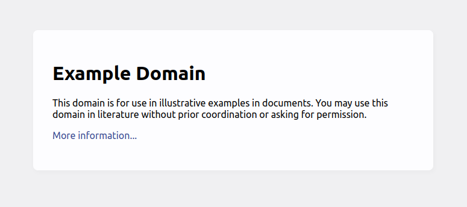

<div align="center">
  
  <br/>
</div>

---

## 🐏 Clone the project

The project can be cloned using the following command:

```sh
# Clone the latest commit of the project using SSH
git clone --depth 1 git@github.com:KikeWTF/Example.git example
```